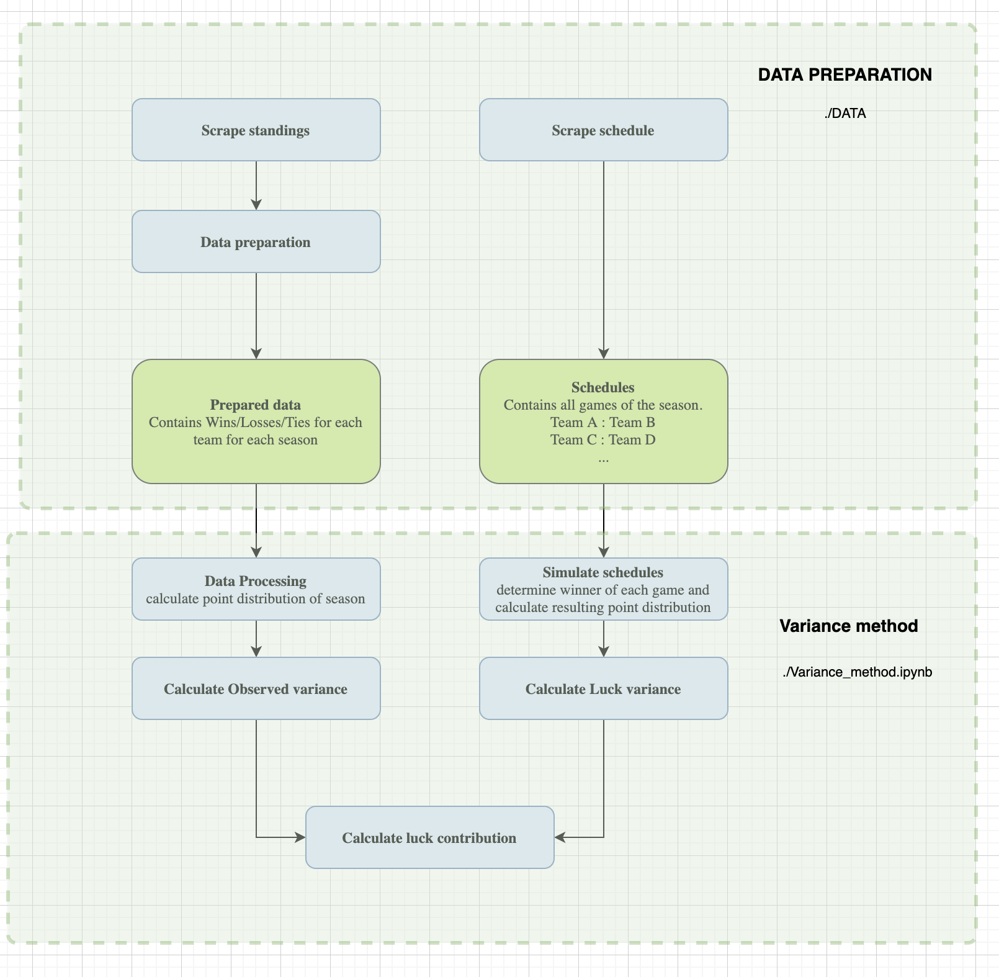

# luck_vs_skill

The interplay of luck and skill in sports is a complicated and highly discussed topic. This paper aims to quantify and interpret the role of luck in various sport leagues. Using Classical Test Theory and the assumption that skill differences between teams become more apparent over the course of a season, the authors estimate luck contributions by comparing the variance of point distributions between actual and simulated results in a "luck-only" scenario.

In order to estimate the luck contribution run `Variance_method.ipynb`.

**At this point the work for climbing and bouldering is highly experimental and cannot be compared to the results of the leagues!**
**The `entropy_method.ipynb` is also highly experimental**

The preprocessing is already done. The results are scraped in `data/data_preparation/scraping_standings`. The schedules are scraped in `data/data_preparation/scraping_schedules`. Some preparation is done in `data/data_preparation/preparation`. The data needed for `Variance_method.ipynb` for each league is in `data/prepared_data`. The schedules for each league and year available are in `data/prepared_data/schedules`.

Config data for each league can be found in `config.yaml`

